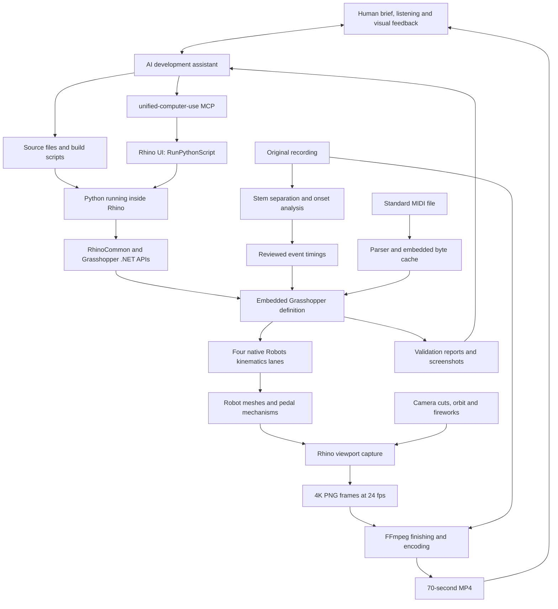

# How AI helped build the Birdland robot drummer

Technical project account · 26 September 2026 · implementation baseline `3fd0bfa`

This demo uses four simulated UR10e robot arms to play a drum kit: two hold sticks, one operates the kick pedal, and one operates the hi-hat pedal. The finished local movie combines the original Weather Report recording of *Birdland* with a 70-second, 3840 × 2160 animation at 24 frames per second. Grasshopper computes the robot poses; separate Rhino scripts direct and capture the movie.

AI acted as a programming and application-operation assistant. It translated the creative brief into scripts, generated the parametric scene, assembled Grasshopper definitions, analyzed audio, implemented camera and effects logic, and checked outputs. Human direction selected the music and visual style and corrected musical and visual mistakes throughout development.

## Controlling Rhino

The assistant used **`mcp__cua_repl.js`** from the **unified-computer-use** plugin to inspect Rhino's UI, run commands and review the scene. It wrote Python scripts to disk and launched them through Rhino's `_-RunPythonScript` command.

Inside Rhino, those scripts used **RhinoCommon, Grasshopper's .NET API and the Robots library** to create geometry, assemble component graphs and solve robot poses. Shell tools handled offline audio analysis, video encoding and Git.

## Architecture



| Layer | Technology and role |
|---|---|
| AI interaction | Natural-language planning, code generation, debugging and interpretation of reports/screenshots |
| Desktop control | `mcp__cua_repl.js`, accessibility inspection and native UI actions |
| Modeling host | Rhino 8; RhinoCommon geometry, document objects, materials and viewport capture |
| Parametric performance | Grasshopper; embedded event data and small Rhino 8 Python 3 components |
| Robot solving | Robots 2.4.0 and the UniversalRobot library; Cartesian targets and inverse kinematics |
| Offline audio analysis | Python, NumPy, SciPy, SoundFile, matplotlib; local `htdemucs` separated stems |
| Presentation | Python camera/effects scripts, Rhino display conduit, PNG capture, FFmpeg |
| Reproducibility | Git source, saved `.gh` definitions, JSON validation reports and a MIDI test fixture |

## From a creative brief to procedural geometry

The core design decision was to use arms for both hand and foot roles. The scene therefore contains four robot bases, a drum kit, two virtual sticks, two pedal pressers, pedal boards, a kick beater, a moving hi-hat top cymbal, and a stage with materials and lighting.

Geometry was generated programmatically rather than drawn manually one object at a time. This made dimensions and placements repeatable and allowed the same performance to be evaluated at any playback time. The dynamic scene contains **49 meshes**: robot/tool geometry plus animated pedal mechanisms. A baked Rhino scene preserves presentation materials and lights.

The first motion approach looked too much like stabbing the drum heads. Human feedback led to a different stick model: a virtual wrist stays behind the contact point while the stick swings through an arc. Rim strokes use a flatter orientation than ordinary head strikes. The result is still a simplified kinematic performance, but its visible gesture better matches drumming.

## What Grasshopper actually computes

The recommended definitions are [Birdland-Python3.gh](../grasshopper/Birdland-Python3.gh) and [MIDI-Drum-Python3.gh](../grasshopper/MIDI-Drum-Python3.gh). The first contains the reviewed Birdland choreography; the second adapts imported drum MIDI.

Their dataflow is explicit:

```text
Playback + event data
    → clock and articulation
    → per-arm rebound
    → tool-tip target plane
    → native Robots Create Target
    → native Robots Kinematics
    → meshes, joint angles, joint planes and errors
```

Robot model, base plane and tool geometry are visible inputs. The robot-loading components define the mechanism and mounting position; downstream target and kinematics components determine its pose. These are simulation components, not connections to physical robot controllers.

For each arm, the motion code finds the nearest relevant hit and evaluates a smooth rebound around it. In simplified form:

```text
phase = clamp(abs(time - nearest_hit) / stroke_window, 0, 1)
rebound = 0.5 - 0.5 * cos(pi * phase)
lift = maximum_lift * rebound * velocity_strength
```

At the event time, the tool reaches its contact pose; away from that instant, it rises. Stick arms convert this value into a wrist-like angular stroke. Pedal arms use it to position a presser. The same pedal lift drives the visible pedal linkage, kick beater or hi-hat opening, keeping mechanism and arm motion coordinated.

The Robots solver converts each target plane into robot joint poses and meshes. This is inverse kinematics, not a force simulation: it does not compute impact, stick flex, torque, friction or physically measured rebound. The detailed graph is documented in [components.md](components.md); implementation is in [src/components](../src/components).

## Music timing: analysis plus human review

The movie uses the **existing Weather Report recording**, not AI-generated music or MIDI synthesis. Source audio and separated stems remain local and are excluded from Git.

The audio workflow combined a reference drum chart, event timing, separated stems and numerical onset analysis. In [analyze_audio.py](../src/analyze_audio.py), a short-time Fourier transform measures energy in frequency bands. Positive changes in low and middle drum-band energy, together with middle-band energy from the full mix, form an accent score:

```text
accent_score = 0.4 * drum_low_change
             + 0.4 * drum_mid_change
             + 0.2 * mix_mid_change
```

Peak detection finds candidate accents; an onset backtrack estimates their beginnings. Filtering within the ensemble-shot passage retained **13 accents, approximately 42.97–55.13 seconds**, which drive fireworks timing and relative intensity. Event times are mapped to the 24 fps timeline.

This was not an automatic, verified note-for-note transcription. Frequency-band energy can confuse instruments, and source separation is imperfect. The user identified that the opening was predominantly hi-hat, that an early kick close-up lacked an audible kick, and that the shots began around 43 seconds. Those observations changed the edit. Human listening was an essential validation step.

The current reviewed camera table is in [edit-analysis.json](../data/edit-analysis.json). **Rerunning the analysis script regenerates its initial camera proposal and can overwrite reviewed cuts.** Preserve the reviewed table and reconcile changes before rendering a new edit.

## Camera, fireworks and final video

The camera is **not part of the performance GH definition**. [render_director.py](../src/render_director.py) sets Rhino's camera position, target and lens for each frame. A moving orbital view provides the wider coverage; instrument-specific close-ups add a slow dolly. The opening was revised to emphasize the hi-hat and then its pedal.

Fireworks are procedural 3D display geometry, synchronized to the measured ensemble accents. Their strength affects burst scale; deterministic random seeds make repeated renders consistent. Short contact highlights emphasize rim strokes. These effects are drawn through a Rhino display conduit rather than generated by an image model.

The renderer evaluates the performance at each frame, updates the dynamic meshes while retaining scene materials, and captures the rendered viewport at native **3840 × 2160**. It produces **1,680 frames for 70 seconds at 24 fps**. [encode.sh](../src/encode.sh) combines the frames with the original audio, applies finishing and titles, and encodes H.264 video with AAC audio. Picture and audio fade from 65 to 70 seconds.

A one-frame zoom glitch at 40 seconds was traced to camera/capture setup and repaired with a native rerender. A warm-up capture establishes the capture dimensions before the first camera frame. Revised close-ups and the faulty frame were rerendered selectively, retaining the original sequence as a baseline.

The existing movie renderer still evaluates the original monolithic `Birdland-Robots.gh`. The newer componentized Python 3 files are the recommended inspectable definitions; their geometry was compared against that baseline. Migration did not mean the whole movie was rendered again through the new graph.

## Reusable MIDI-to-Grasshopper adapter

[midi_adapter.py](../src/midi_adapter.py) parses Standard MIDI Files directly, without additional Python packages inside Grasshopper. It handles types 0 and 1, tempo maps, running status, note-on messages with zero velocity, and SMPTE timing. General MIDI notes map to kick, snare, rim, closed/open hat, hat pedal and cymbals. Toms can be routed to the snare or ignored; unsupported notes are reported.

Velocity changes stroke strength, and hi-hat notes affect open/closed state. The adapter supports channel selection, timing offset and playback speed. On successful import, the original MIDI bytes are encoded into an embedded GH panel and the external path is cleared through a scheduled Grasshopper update. Saving the definition then makes it independent of the original MIDI file.

The adapter does not generate audio, and it cannot make every dense drum arrangement physically playable by two stick arms. It is a reusable event-to-kinematics adapter, not a general robot performance scheduler.

## Refactoring and migration

The initial graph concentrated much of the behavior in a large legacy GhPython script. Human review exposed two problems: the internal logic was difficult to inspect, and the layout made robot components look disconnected from the performance.

The assistant split the logic into clock, articulation, rebound, target-plane, tool and pedal components, then exposed native Robots target and kinematics components in four readable lanes. The final migration replaced legacy scripting nodes with Rhino 8 Python 3 components: **14 in the Birdland definition and 15 in the MIDI definition, with no legacy GhPython nodes in either**.

Migration required more than changing labels. Python/.NET list marshalling had to be configured so outputs behaved as ordinary GH lists, geometry imports were made explicit, and groups were rebuilt to remove stale canvas bounds. Earlier definitions remain as regression references. See [migrate_python3.py](../src/migrate_python3.py) and [the component documentation](components.md).

## How the work was checked

| Check | Recorded result | Evidence |
|---|---|---|
| MIDI parser tests | Seven tests covering timing, parsing, mapping and failure cases | [test_midi_adapter.py](../tests/test_midi_adapter.py) |
| Embedded MIDI performance | 217 sampled times, 868 arm poses | [midi-validation.json](../data/midi-validation.json) |
| Python 3 regression | 57 times per definition; 456 total arm poses; 49 meshes per sample; zero reported IK errors; all mesh-vertex hashes matched the originals | [python3-validation.json](../data/python3-validation.json) |
| Saved Python 3 definitions | Both reloaded with 49 meshes and no reported errors | [python3-validation.json](../data/python3-validation.json) |
| MIDI internalization and recovery | Fresh import survived save/reload without its source file; malformed import preserved valid cached data and recovered after clearing the bad path | [python3-import-validation.json](../data/python3-import-validation.json) |
| Camera revision | Opening close-ups and the 40-second frame repaired and reviewed | [camera-revision-validation.json](../data/camera-revision-validation.json) |

Numerical checks were supplemented by Rhino/GH screenshots and human movie review. Mesh equality establishes that the tested migration preserved the prior geometry; it does not establish physical feasibility. Sampled IK checks also do not prove collision freedom or valid joint speeds between samples.

## Attribution, scope and reproduction

The human collaborators supplied the assignment context, creative choices, musical observations and acceptance feedback. AI supplied implementation assistance and operated the tools. The original music, reference chart, Rhino, Grasshopper, Robots and other dependencies are third-party works; this project did not create them. The commit identity records the requested repository owner, not a claim that the implementation was written without AI assistance.

To inspect the result, follow the [README](../README.md): install the documented Rhino/Robots dependencies, open a recommended Python 3 definition, and scrub its playback slider. For MIDI, import a file and save the definition after its bytes are internalized. Run parser tests with:

```sh
python3 -m unittest discover -s tests -v
```

Movie reproduction additionally requires the local audio/stems, a Rhino rendering session and the rendering/encoding dependencies. Rendering is an application-driven process, not a single portable headless build. See [rendering.md](rendering.md) and [local-artifacts.md](local-artifacts.md) for the workflow and local output locations. The repository excludes the original recording, stems, PNG sequences and movies.

The completed work is a visual, kinematic demo. **No physical robot connection or execution occurred.** Collision checking, joint speed/acceleration constraints, calibrated tools, contact mechanics and controller-ready programs remain outside its validated scope. The [assignment audit](assignment-audit.md) distinguishes the supplied simulation deliverables from physical execution and other course requirements.

### Project and reference links

- [Project repository](https://github.com/Guu9/birdland-robots) — access follows its private repository permissions.
- [Robots plugin source](https://github.com/visose/Robots).
- [McNeel scripting-component documentation](https://developer.rhino3d.com/guides/scripting/scripting-component/) and [Python marshalling documentation](https://developer.rhino3d.com/guides/scripting/scripting-gh-python/#marshalling).
- [Recording: Weather Report official artist channel](https://www.youtube.com/watch?v=SvhmaNlLgRM).
- [Reference drum chart: Pedro Marambio / Drumeo](https://d1923uyy6spedc.cloudfront.net/weather-report-birdland-1674639029.pdf).
