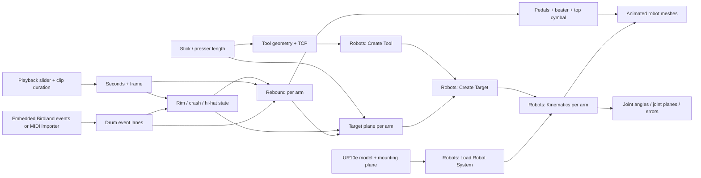

# Component map

The four blue lanes correspond to snare, hi-hat/crash, kick pedal, and hi-hat pedal. The mounting-plane parameter supplies each robot loader, which supplies its kinematics node. It does not generate the beat or drive hardware. All important dependencies have visible ports and wires; faint wires indicate shared controls.

The native Robots components perform actual target construction and inverse kinematics. The small Python 3 components contain musical timing and custom kit geometry. Open `Birdland-Python3.gh` or `MIDI-Drum-Python3.gh` for the current definitions: these use Rhino 8's modern scripting component throughout. Legacy files are retained separately.

Python 3 migration explicitly enables input/output list conversion so event lists and mesh lists travel through normal Grasshopper wires. It also uses explicit Rhino.Geometry imports rather than IronPython's wildcard import behavior. No external Python package is required, and the imported MIDI bytes stay inside the definition.

The camera, audio muxing, fireworks and video finishing are still in `src/render_director.py` and `src/encode.sh`. The GH graph computes the performance geometry; it does not play audio or operate a physical controller.

To rebuild, run `src/build_components.py`, `src/polish_components.py`, then `src/migrate_python3.py` inside Rhino. The migration uses [McNeel's script-component creation API](https://discourse.mcneel.com/t/programmatically-creating-new-c-python-script-components/199692/15), introduced in Rhino 8 SR18. It preserves port order, list/item access, wires, positions, groups and preview visibility.

Run `src/validate_python3.py` to compare all mesh-vertex hashes with the original performances and check saved-file reloads. Run `src/validate_python3_import.py` twice, returning to Rhino between runs: it tests a fresh import, scheduled cache update, save/reload with the source MIDI absent, and recovery after a malformed import. Test files live in a temporary directory; the supplied demo remains untouched.
