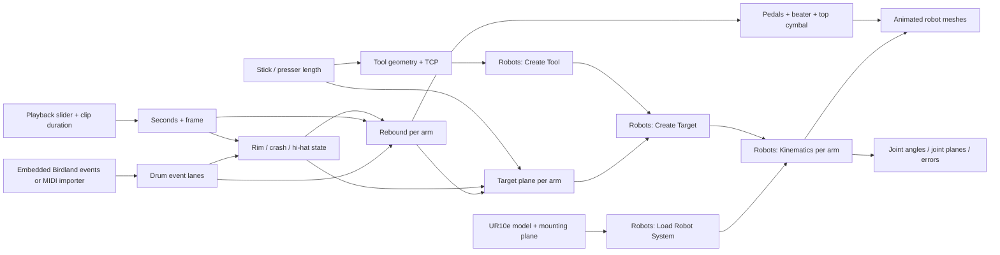

# Component map

The four blue lanes correspond to snare, hi-hat/crash, kick pedal, and hi-hat pedal. The mounting-plane parameter supplies each robot loader, which supplies its kinematics node. It does not generate the beat or drive hardware. All important dependencies have visible ports and wires; faint wires indicate shared controls.

The native Robots components perform actual target construction and inverse kinematics. The small GhPython components contain the musical timing and custom kit geometry. Rhino's **OLD** badge identifies the legacy GhPython engine, not stale results or disabled nodes. Migration to Rhino 8's newer scripting component has not been performed.

The camera, audio muxing, fireworks and video finishing are still in `src/render_director.py` and `src/encode.sh`. The GH graph computes the performance geometry; it does not play audio or operate a physical controller.

Build with `src/build_components.py` inside Rhino. `src/validate_components.py` compares mesh vertices with both original definitions and tests save/reload. `src/polish_components.py` reduces visual clutter from shared-control wires.
